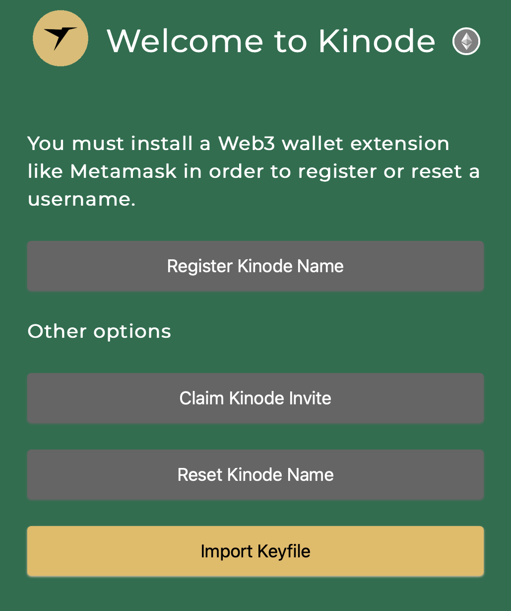
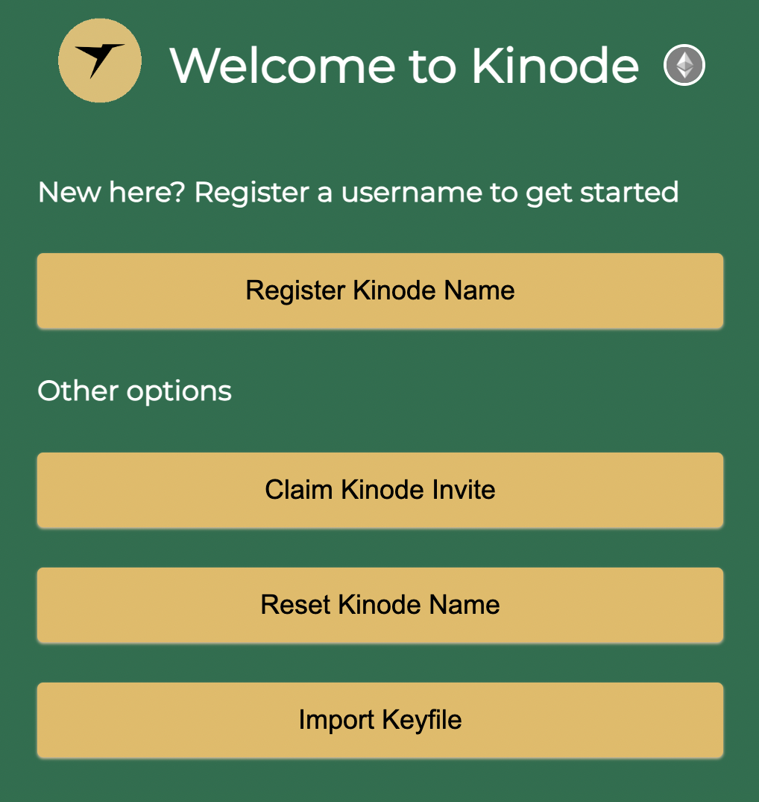
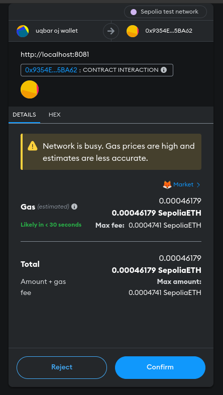
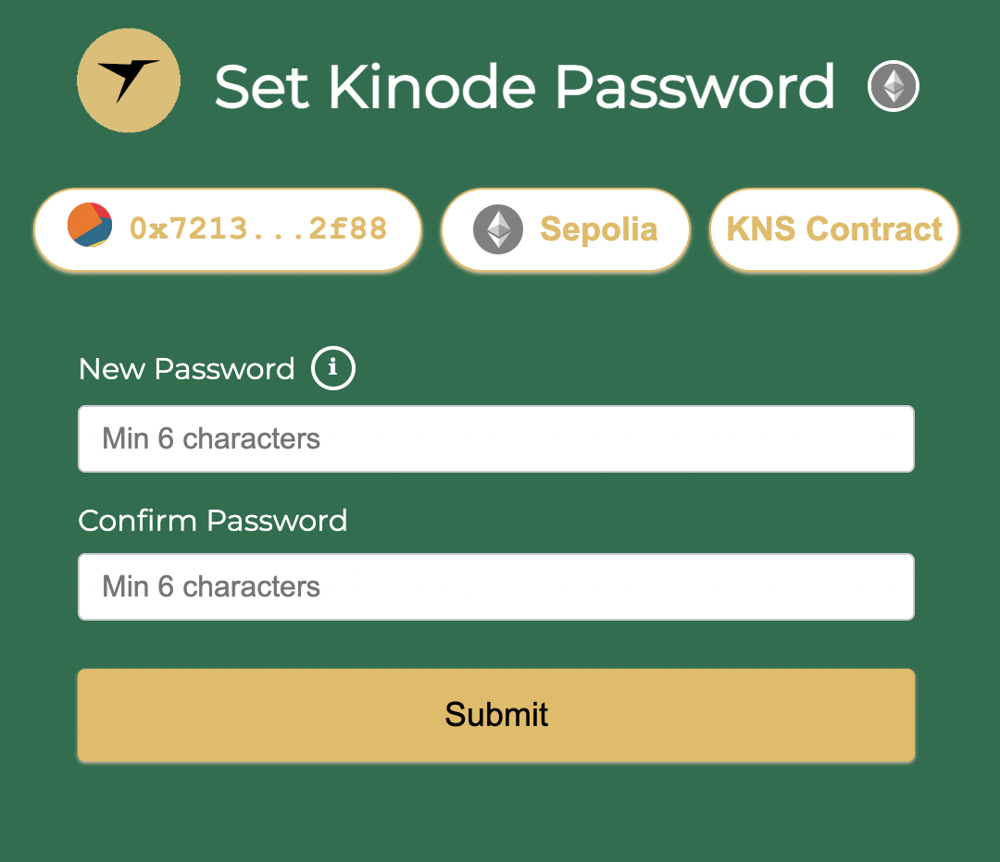
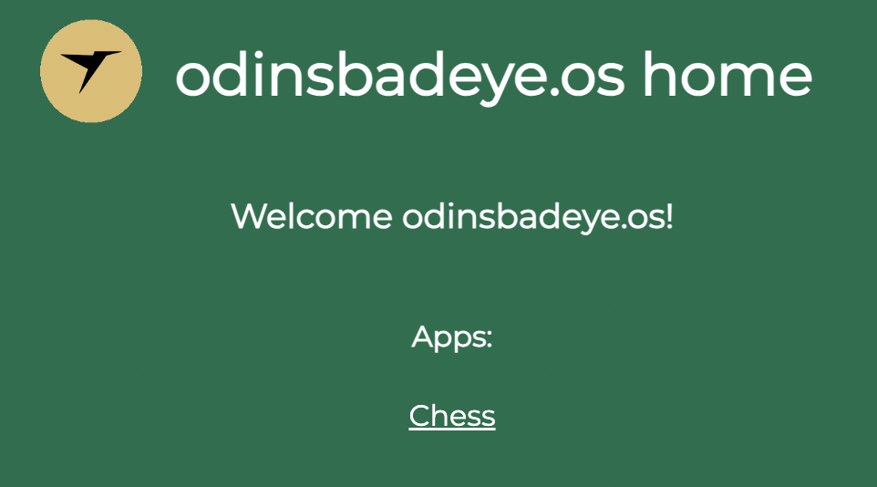

# Join the Network

Let's get onto the live network!

These directions are particular to the Kinode OS alpha release.
Joining the network will become significantly easier on subsequent releases.

Note: While Kinode will eventually post identities to Optimism, the alpha release uses the Ethereum Sepolia testnet.

## Creating an Alchemy Account

Alchemy is used as an [Ethereum RPC endpoint](#acquiring-an-rpc-api-key) and as a [faucet for Sepolia testnet ETH](#aside-acquiring-sepolia-testnet-eth).
An Ethereum RPC endpoint and Sepolia ETH are required to send and receive Ethereum transactions that support the Kinode identity system.
If you do not already have one, register an [Alchemy account](https://www.alchemy.com/).
The account is free and requires only an email address for registration.

## Starting the Kinode

Start an Kinode using the binary acquired in the [previous section](./install.md).
Locating the binary on your system, run:

```bash
$ ./kinode --help
```
This will print the arguments expected by the binary:

```bash
A General Purpose Sovereign Cloud Computing Platform

Usage: kinode [OPTIONS] --rpc <WS_URL> <home>

Arguments:
  <home>  Path to home directory

Options:
      --port <PORT>   First port to try binding
      --testnet       Use Sepolia testnet
      --rpc <WS_URL>  Ethereum RPC endpoint (must be wss://)
  -h, --help          Print help
  -V, --version       Print version
```

A home directory must be supplied — where the node will store its files.
The binary also takes a required `--rpc` flag.
The `--rpc` flag is a `wss://` WebSocket link to an Ethereum RPC, allowing the Kinode can send and receive Ethereum transactions — used in the [identity system](./identity_system.md) as mentioned [above](#creating-an-alchemy-account).
Finally, by default, the node will bind to port 8080; this can be modified with the `--port` flag.

### Acquiring an RPC API Key

Create a new "app" on [Alchemy](https://dashboard.alchemy.com/apps) on the Ethereum Sepolia network.


Copy the WebSocket API key from the API Key button:


### Running the Binary

Replace the `--rpc` field below with the WebSocket API key link copied from [the previous step](#acquiring-an-rpc-api-key), and start the node with:

```bash
./kinode home --rpc wss://eth-sepolia.g.alchemy.com/v2/<your-api-key>
```

A new browser tab should open, but if not, look in the terminal for a line like

```
login or register at http://localhost:8080
```

and open that `localhost` address in a web browser.

## Registering an Identity

Next, register an identity.
If the page looks like:



then proceed to [Acquiring a Wallet](#aside-acquiring-a-wallet).
Otherwise, if the page looks like:



the browser already has a supported wallet installed.
Click `Register NecName` and proceed to [Connecting the Wallet](#connecting-the-wallet).

### Aside: Acquiring a Wallet

To register an identity, Kinode must send an Ethereum transaction, which requires ETH and a cryptocurrency wallet.
While many wallets will work, the examples below use Metamask.
Install Metamask [here](https://metamask.io/download/).

### Connecting the Wallet

After registering a username, click through until you reach `Connect Wallet` and follow the wallet prompts:


### Aside: Acquiring Sepolia Testnet ETH

Using the Alchemy account [registered above](#creating-an-alchemy-account), use the [Sepolia faucet](https://sepoliafaucet.com/) to acquire Sepolia ETH if you do not already have some in your wallet.
Then, return to the Kinode.

### Setting Up Networking (Direct vs. Routed Nodes)

When registering on Kinode, you may choose between running a direct or indirect (routed) node.
Most users should use an indirect node.
To do this, simply leave the box below name registration unchecked.


Am indirect node connects to the network through a router, which is a direct node that serves as an intermediary, passing packets from sender to receiver.
Routers make connecting to the network convenient, and so are the default.
If you are connecting from a laptop that isn't always on, or that changes WiFi networks, use an indirect node.

A direct node connects directly, without intermediary, to other nodes (though they may, themselves, be using a router).
Direct nodes may have better performance, since they remove middlemen from connections.
Direct nodes also reduces the number of third parties that know about the connection between your node and your peer's node (if both you and your peer use direct nodes, there will be no third party involved).

Use an indirect node unless you are familiar with running servers.
A direct node must be served from a static IP and port, since these are registered on the Ethereum network and are how other nodes will attempt to contact you.

Regardless, all packets, passed directly or via a router, are end-to-end encrypted.
Only you and the recipient can read messages.

As a direct node, your IP is published on the blockchain.
As an indirect node, only your router knows your IP.

### Sending the Registration Transaction

After clicking `Register Necname`, click through the wallet prompts to send the transaction:




### What Does the Password Do?

The password encrypts the node's networking key.
The networking key is how your node communicates securely with other nodes, and how other nodes can be certain that you are who you say you are.



## Welcome to the Network

After setting the node password, you will be greeted with the homepage.


